# All-Media-Deepfake-Detection-and-Data-Security

# DeepDetect - Advanced Deepfake & PII Detection

A comprehensive web-based solution for detecting AI-generated content (Deepfakes) across images, videos, and text, along with Sensitive Data (PII) protection.

## About
DeepDetect is a project designed to combat the rising threat of misinformation and privacy violations caused by Generative AI. As deepfakes become more realistic, traditional verification methods fail. This project integrates state-of-the-art Deep Learning models (Vision Transformers, MTCNN) and Natural Language Processing (NLP) to analyze media files and text. It features a modern, glassmorphism-based UI to provide users with an intuitive interface for verifying digital content and redacting sensitive information.

## Features
* **Multi-Modal Detection:** Capable of analyzing Images, Videos, and Text documents.
* **Advanced Deep Learning:** Uses `prithivMLmods/Deep-Fake-Detector-v2-Model` and Vision Transformers for high-accuracy deepfake detection.
* **Frame-by-Frame Video Analysis:** Extracts and analyzes individual video frames to detect temporal anomalies.
* **PII Protection:** Automatically detects and redacts Personally Identifiable Information (PII) using Microsoft Presidio.
* **Secure Data Handling:** Implements AES-256 encryption for all uploaded files to ensure user privacy.
* **Modern UI/UX:** Responsive Glassmorphism design with real-time progress tracking and dynamic result cards.

## Requirements
* **Operating System:** Requires a 64-bit OS (Windows 10/11, Ubuntu, or macOS) for compatibility with PyTorch/TensorFlow.
* **Development Environment:** Python 3.8 or later is necessary for the Flask backend.
* **Deep Learning Frameworks:** PyTorch and Transformers (Hugging Face) for model inference.
* **Image Processing Libraries:** OpenCV (cv2) and MTCNN for facial feature extraction and preprocessing.
* **NLP Libraries:** Presidio Analyzer for PII detection and various Transformer models for text analysis.
* **Web Framework:** Flask (Python) for the backend API and serving HTML templates.
* **Additional Dependencies:** `cryptography` for file encryption, `werkzeug` for secure file handling, and `Pillow` for image manipulation.

## System Architecture

```mermaid
graph LR
    %% Define styles
    classDef user fill:#2d3436,stroke:#dfe6e9,stroke-width:2px,color:#dfe6e9;
    classDef flask fill:#0984e3,stroke:#74b9ff,stroke-width:2px,color:white;
    classDef ai fill:#6c5ce7,stroke:#a29bfe,stroke-width:2px,color:white;
    classDef storage fill:#00b894,stroke:#55efc4,stroke-width:2px,color:white;

    subgraph Client_Side ["Client Side"]
        direction TB
        Mobile("📱 Mobile Web"):::user
        Web("💻 Desktop Web"):::user
    end

    subgraph Server_Side ["DeepDetect Core System"]
        direction TB
        
        Frontend("JS Interface"):::flask
        Backend("Flask Controller"):::flask
        
        subgraph Models ["AI Detection Engine"]
            direction TB
            Img("Image Model"):::ai
            Vid("Video Model"):::ai
            Txt("Text/GenAI Check"):::ai
            PII("PII Scanner"):::ai
        end
        
        Storage[("Local Data")]:::storage
    end

    %% Connections
    Mobile -->|"Upload Media"| Backend
    Web -->|"Upload Media"| Backend
    Backend <-->|"Serve UI"| Frontend
    
    %% Connect Flask to all models
    Backend -->|"Process"| Img
    Backend -->|"Process"| Vid
    Backend -->|"Process"| Txt
    Backend -->|"Process"| PII
    
    %% Results back
    Img & Vid & Txt & PII -->|"Return Probability"| Backend
    
    Backend -->|"Save Report"| Storage

    %% Layout hints
    style Server_Side fill:#f1f2f6,stroke:#b2bec3,stroke-dasharray: 5 5
```

* **Frontend:** HTML5, CSS3 (Glassmorphism), JavaScript (Fetch API).
* **Backend:** Flask (REST API).
* **AI Engine:** Hugging Face Transformers, MTCNN, Presidio.
* **Storage:** AES-Encrypted local storage for temporary processing.

## Output

### Output 1 - Image Detection
_Detects if a face in an uploaded image is Real or Fake._

### Output 2 - Video Analysis
_Scans video files frame-by-frame to identify manipulation._

### Output 3 - PII Redaction
_Identifies sensitive entities (Names, Phones, Emails) and encrypts the file._

**Detection Accuracy:** ~96% (Varies by model and input quality)

## Results and Impact
DeepDetect empowers individuals and organizations to verify the authenticity of digital media in real-time. By integrating PII protection, it also serves as a dual-purpose tool for security and privacy. The project showcases the potential of combining Computer Vision and NLP to create a safer digital environment, mitigating the risks of identity theft and disinformation campaigns.

## References / Models Used
1.  **Image Model:** [prithivMLmods/Deep-Fake-Detector-v2-Model](https://huggingface.co/prithivMLmods/Deep-Fake-Detector-v2-Model)
2.  **Face Detection:** MTCNN (Multi-task Cascaded Convolutional Networks)
3.  **PII Detection:** Microsoft Presidio
4.  **Backend:** Flask Documentation
